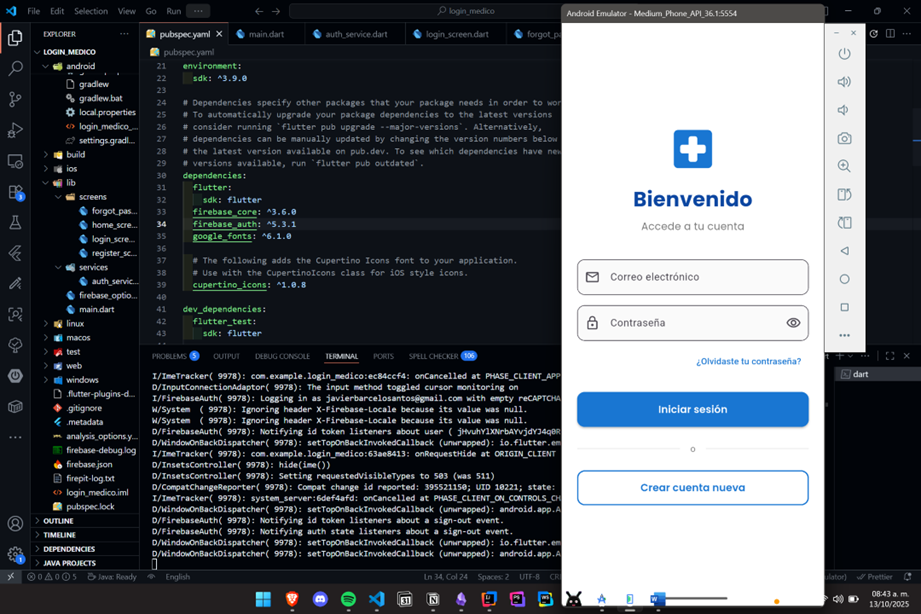

# 🏥 App de Login con Firebase Auth

Aplicación de inicio de sesión desarrollada en Flutter con integración de Firebase Authentication, diseñada con una interfaz inspirada en aplicaciones de citas médicas.

## 📱 Características

- ✅ Login con correo y contraseña
- ✅ Registro de nuevos usuarios
- ✅ Recuperación de contraseña
- ✅ Validación de formularios
- ✅ Diseño moderno y responsivo
- ✅ Integración completa con Firebase Auth

## 🚀 Requisitos previos

- Flutter SDK (>= 3.0.0)
- Dart SDK
- Android Studio / Xcode
- Cuenta de Firebase

## 🔧 Configuración

### 1. Clonar el repositorio

```bash
git clone https://github.com/Jarvyes14/login-medico
cd mi_app_login
```

### 2. Instalar dependencias

```bash
flutter pub get
```

### 3. Configurar Firebase

1. Ve a [Firebase Console](https://console.firebase.google.com/)
2. Crea un nuevo proyecto
3. Agrega una aplicación Android/iOS
4. Descarga el archivo de configuración:
   - Android: `google-services.json` → colócalo en `android/app/`
   - iOS: `GoogleService-Info.plist` → colócalo en `ios/Runner/`
5. En Firebase Console, ve a **Authentication** → **Sign-in method**
6. Habilita **Correo electrónico/contraseña**

### 4. Ejecutar la aplicación

```bash
flutter run
```

## 📂 Estructura del proyecto

```
lib/
├── main.dart                 # Punto de entrada
├── screens/
│   ├── login_screen.dart     # Pantalla de login
│   ├── register_screen.dart  # Pantalla de registro
│   ├── forgot_password_screen.dart  # Recuperar contraseña
│   └── home_screen.dart      # Pantalla principal
└── services/
    └── auth_service.dart     # Servicio de autenticación
```

## 🎨 Elementos implementados

1. ✅ Campo de correo electrónico
2. ✅ Campo de contraseña (con toggle para mostrar/ocultar)
3. ✅ Botón "Olvidaste tu contraseña"
4. ✅ Botón "Crear cuenta nueva"
5. ✅ Botón "Iniciar sesión"

## 📸 Capturas de pantalla



## 🔐 Funcionalidades de Firebase

- **Autenticación**: Login con correo y contraseña
- **Registro**: Creación de nuevas cuentas
- **Recuperación**: Envío de correo para restablecer contraseña
- **Validación**: Mensajes de error personalizados
- **Sesión**: Manejo de estado de autenticación

## 🧪 Probar la aplicación

### Crear una cuenta de prueba:
1. Abre la app
2. Toca "Crear cuenta nueva"
3. Ingresa un correo y contraseña (mínimo 6 caracteres)
4. Toca "Crear cuenta"

### Iniciar sesión:
1. Ingresa el correo y contraseña registrados
2. Toca "Iniciar sesión"
3. Serás redirigido a la pantalla de inicio

## 📝 Tecnologías utilizadas

- Flutter 3.x
- Firebase Auth
- Google Fonts
- Material Design 3

## 👨‍💻 Autor

Javier Barceló Santos
